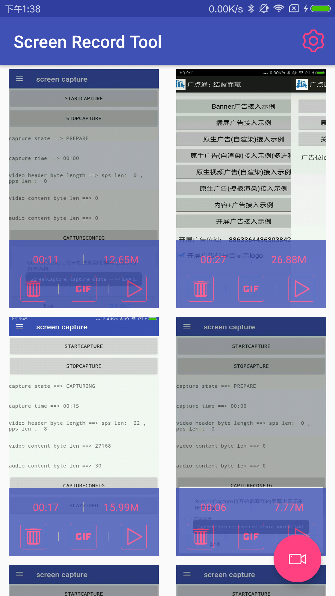

	

<h3 align="center">ScreenRecordTool</h3>

## provide screen record tool , and the MP4 files that support the recording are converted to GIF

## The screen recording function comes from [ScreenCapture][1]

## 【**unfinished**】The GIF transforming function comes from [MP4TransferToGif][2]

## screenshot

### License

    Licensed under the Apache License, Version 2.0 (the "License");
    you may not use this file except in compliance with the License.
    You may obtain a copy of the License at

       http://www.apache.org/licenses/LICENSE-2.0

    Unless required by applicable law or agreed to in writing, software
    distributed under the License is distributed on an "AS IS" BASIS,
    WITHOUT WARRANTIES OR CONDITIONS OF ANY KIND, either express or implied.
    See the License for the specific language governing permissions and
    limitations under the License.

[1]: https://github.com/HelloHuDi/ScreenCapture
[2]: https://github.com/HelloHuDi/MP4TransferToGif